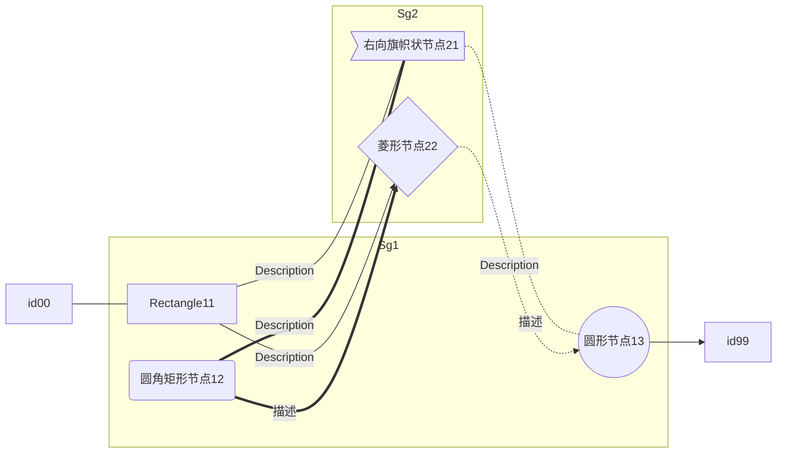
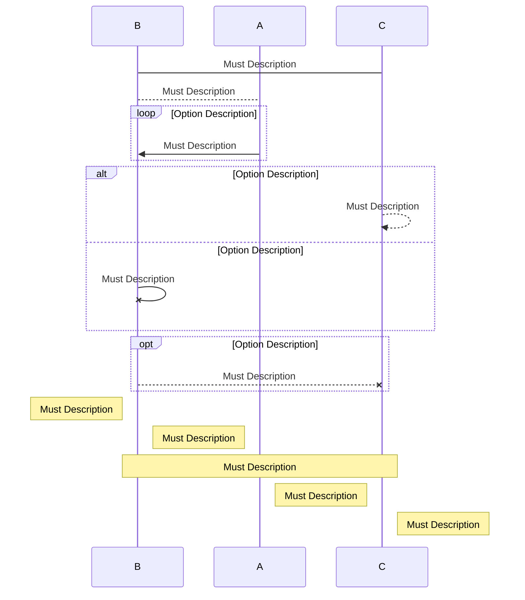
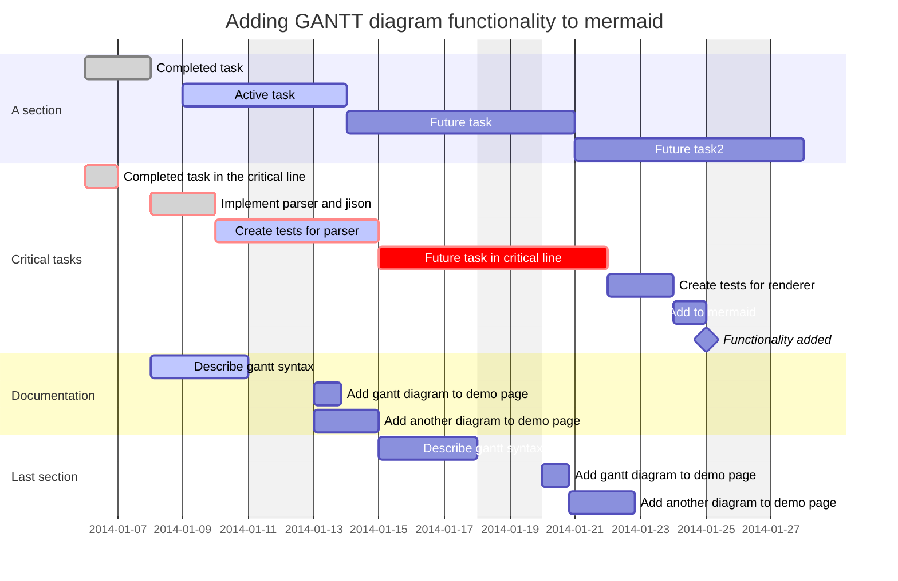

作为一个文本化狂热分子，坚定的文本派，必须要码图，而不画图。

## graph 流程图

```
%% T=TOP,B=BOTTOM,L=LEFT,R=RIGHT,D=DOWN
%% TB,BT,LR,RL,TD,DT
%% [],(),(()),>],{}
%% -->,---,--text---,--text-->,-.-,-.->,-.text.-,-.text.->,===,==>,==text===,==text==>
graph LR
  subgraph Sg1
    id11[Rectangle11]
    Id12("圆角矩形节点12")
    iD13(("圆形节点13"))
  end
  subgraph Sg2
    ID21>"右向旗帜状节点21"]
    Id22{"菱形节点22"}
  end
  id00---id11
  id11--Description---ID21
  id11--Description-->Id22
  Id12==Description===ID21
  Id12=="描述"==>Id22
  ID21-."描述".-iD13
  Id22-.Description.->iD13
  iD13-->id99
```

## sequence diagram 序列图

```
%% participant Use_participant_control_sequence
%% note [right of | left of][Actor]:Text
%% note over [Actor1, Actor2...]:Text
%%% loop Loop_text
%%% ... statements...
%%% end
%%%% alt Describing_text
%%%% ...statements...
%%%% else
%%%% ...statements...
%%%% end
%%%%% opt Describing_text
%%%%% ...statements...
%%%%% end
%% ->,-->,->>,-->>,-x,--x
sequenceDiagram
  participant B
  participant A
  participant C
  B->C:Must Description
  B-->A:Must Description
  loop Option Description
    A->>B:Must Description
  end
  alt Option Description
    C-->>C:Must Description
  else Option Description
    B-xB:Must Description
  end
  opt Option Description
    B--xC:Must Description
  end
  note left of B:Must Description
  note right of B:Must Description
  note over B,C:Must Description
  note left of C:Must Description
  note right of C:Must Description
```

## gantt diagram 甘特图


## 参考
- 官方文档：<https://mermaid-js.github.io/mermaid/#/>
